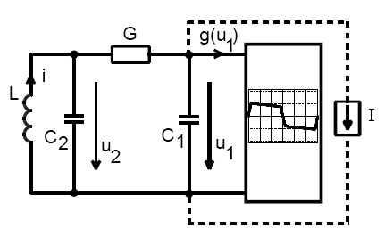
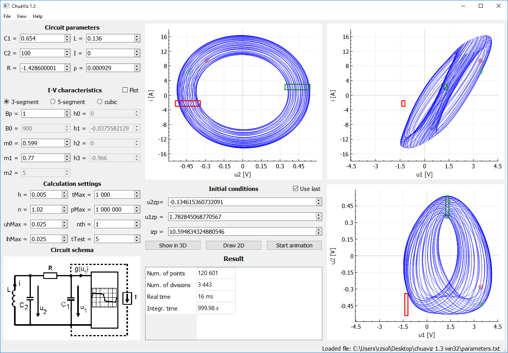
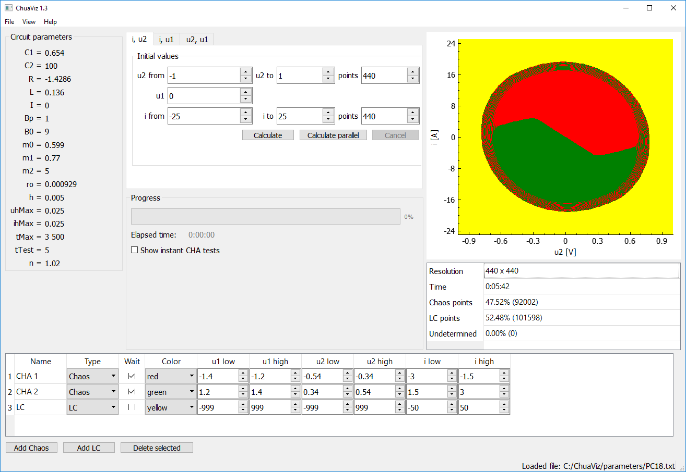
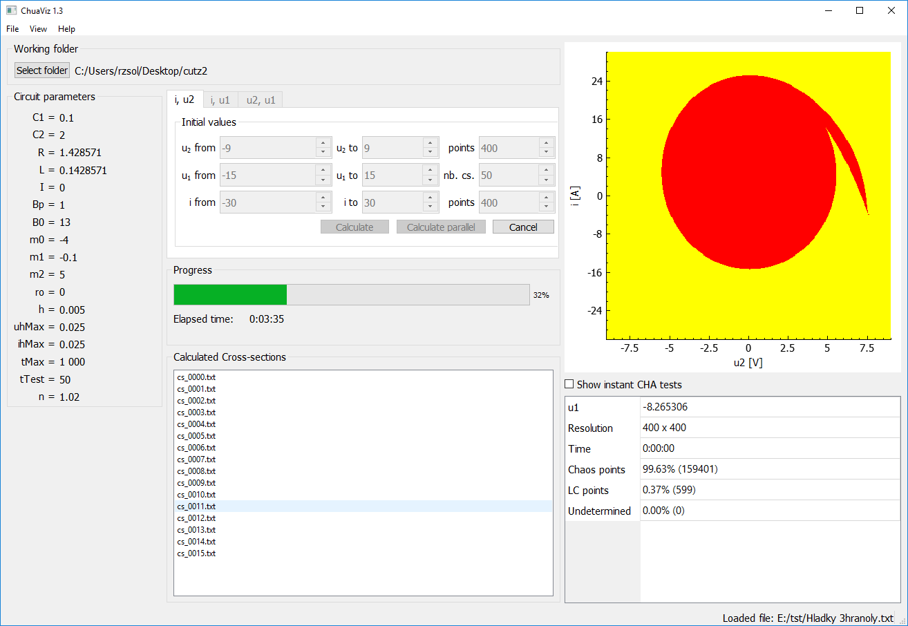
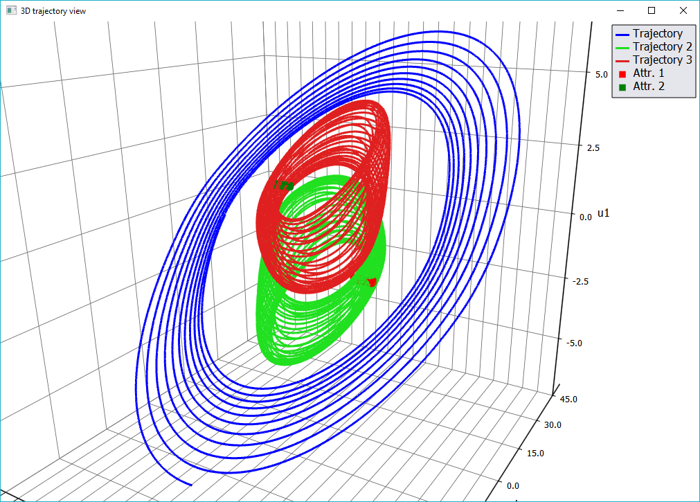

# Visualizer of state space of Chua's circilt (ChuaViz) 
Chua’s circuit is a simple autonomous circuit introduced by L. O. Chua, which under certain circumstances can show chaotic behavior. This application is intended for researching these circumstances.

## User interface

### Calculation and visualization of a single trajectory
This first view allows to modify the parameters, perform the calculation of a single trajectory and visualize the result using 3 planes. The projected trajectory can be then moved by dragging and zoomed by mouse scrolling. The cuboids for CHA testing required for BS calculation are also visualized in this view.

### Calculation of a cross section of boundary surface
The second view, which can be seen on figure below, is intended for the calculation and visualization of a single cross-sectionof the BS. Among others it allows to define new and modify existing cuboids for CHA and SLC testing

### Cross section series calculation
The application can calculate a set of 2D cross sections of the boundary surface in order to give a notion about how does the BS look in 3D space   

### 3D visualization of 
Individual trajectories can be shown in a rotatable and zoomable 3D view.

## Related publications

- Zsolt RÁCZ; Milan GUZAN; Branislav SOBOTA: _Parallelizing boundary surface computation of Chua's circuit_ 
https://ieeexplore.ieee.org/document/7937582
- Branislav SOBOTA; Milan GUZAN: _Calculation of cross-sections of boundary surface using parallelization_ 
https://ieeexplore.ieee.org/abstract/document/8327272
- Milan GUZAN; Patrik KOVÁČ; Irena KOVÁČOVÁ; Matej BEREŠ; Andrii GLADYR: _Boundary surface of Chua's circuit in 3D state space_ 
https://ieeexplore.ieee.org/abstract/document/8248940
- Peter HALACHAN; Milan GUZAN: _Usage of Python programming language in 3D modeling_ 
http://www.jiee.eu/wp-content/uploads/papers/vol2i1/v2i1_Halachan_Guzan.pdf 

## About the project
This project has been developed as part of master's thesis _Utilization of a mobile phone for measuring driver's aggression and traffic flow_ by [_Zsolt Rácz_](https://zsoltracz.com/).

The thesis is available here (in Slovak language): 
https://opac.crzp.sk/?fn=detailBiblioForm&sid=998D604438B59F55B68453FC0D22

